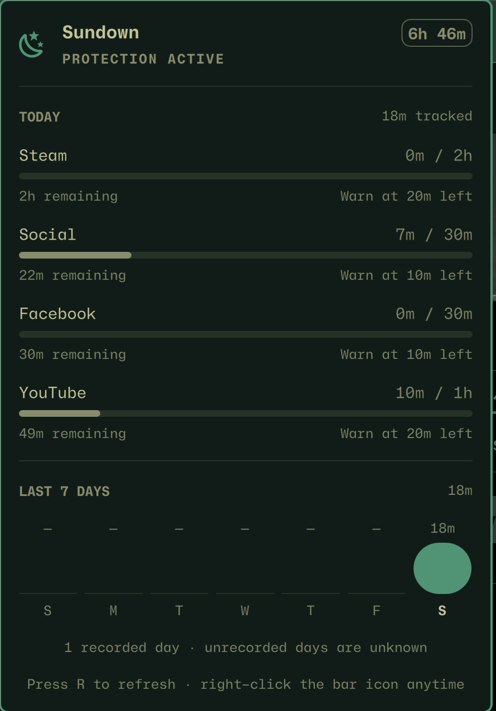

# Sundown for Omarchy

A native Omarchy bar panel for Sundown allowances, schedules, prerequisites,
earned time, flex passes, curfew state, browser health, and seven-day Screen
Time history.



Website allowances appear as compact group rows such as `Social`.
Constituent-domain accounting remains available in Sundown's JSON reports,
without crowding the panel. Healthy browser protection is silent; a browser
warning appears only when protection needs attention.

Sundown's Rust daemon remains authoritative. This independently versioned
plugin stores no policy or usage data. It reads status and reports with:

```bash
sundown status --json
sundown report week --json
```

When flex passes are configured, the panel can explicitly redeem one through:

```bash
sundown flex redeem TARGET
```

The daemon validates the caller, target, remaining passes, schedule, curfew,
morning focus, and prerequisite gate before recording any redemption.

When an Evercount-backed prerequisite is configured, the Today view offers an
explicit sync action. It runs the separately installed read-only adapter and
refreshes panel status after a successful reconciliation:

```bash
sundown-adapter-evercount sync
```

The panel also reads `sundown-adapter-evercount status` to show provider health
and the last successful evidence delivery. Other providers remain explicit
when their health or last-sync metadata is unavailable. The compatibility
mapping and the expected provider-neutral core field are documented in
[`docs/provider-boundary.md`](docs/provider-boundary.md).

## Install

Install the Sundown core first. Then add this repository through Omarchy:

```bash
omarchy plugin add https://github.com/silouanwright/sundown-omarchy.git --enable
```

The panel is optional. Sundown's application limits and curfew continue to
work without Omarchy, and browser limits require Sundown's separately
package-managed Chromium integration rather than this plugin.

Update or remove it through the same Omarchy plugin manager:

```bash
omarchy plugin update io.github.silouanwright.sundown
omarchy plugin remove io.github.silouanwright.sundown
```

## Compatibility

Plugin `0.2.x` supports Sundown status/report protocol `1`. A lower protocol
version prompts the user to update the Sundown core; a higher version prompts
the user to update this plugin. The top-level `version` field in both JSON
commands is the protocol contract, independent of either package version.

## Development

```bash
node tests/model.test.js
tests/run-qml-checks
tests/run-qt-quick-tests
omarchy plugin validate .
```

The plugin requires no third-party QML packages.

The static [Today](docs/assets/panel-today-osaka-jade.png) and
[History](docs/assets/panel-history-catppuccin-latte.png) captures are visual-QA
evidence for the existing panel views. They are not additional plugin surfaces.

## Privacy and permissions

The plugin runs `/usr/bin/sundown status --json`, `/usr/bin/sundown report week
--json`, and `/usr/bin/sundown-adapter-evercount status`. Only explicit panel
actions run `/usr/bin/sundown flex redeem TARGET` or
`/usr/bin/sundown-adapter-evercount sync`. The adapter owns its read-only
network request and credential; the QML process never reads or passes the
token. The plugin has no installer, privileged actions, or persistent state.
Usage policy, counters, browser integration, and enforcement remain in the
separately installed Sundown core.

## License

MIT
